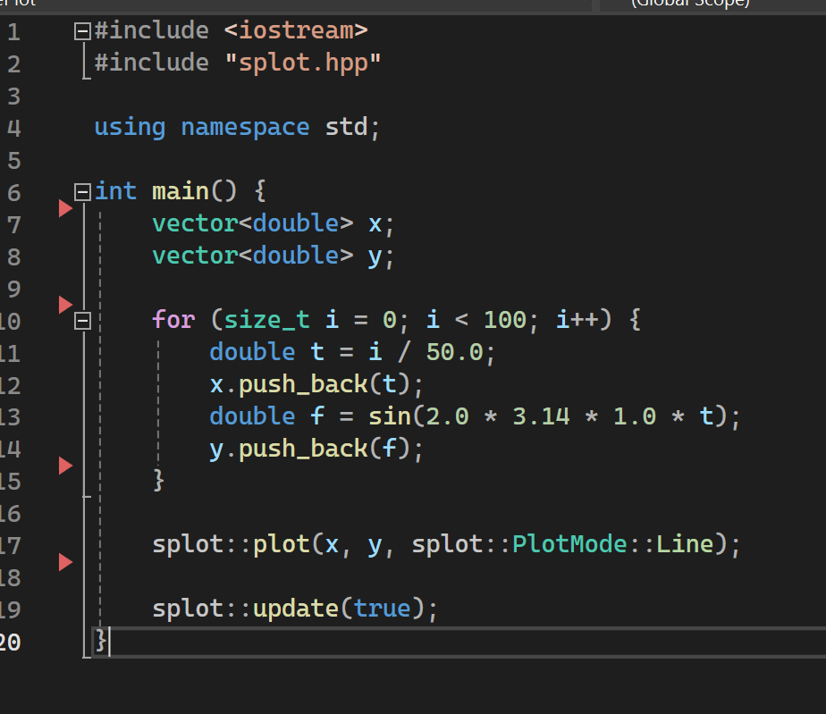

Plotting library in C++.
Single header with no dependencies (Win32 for now, linux support will be added in future). Requires OpenGL 3.3.
Supports matrix inversion.

<h1>TODO:</h1>
<ul>
    <li>Font Rendering (Currently)</li>
    <li>Export library to single header file</li>
    <li>Finish subplot positioning</li>
    <li>Improved Point Rendering (Circular points instead of rects)</li>
    <li>Refactor Code</li>
</ul>

<h3>Demo:</h3>
<h6>Sample Code:</h6>

